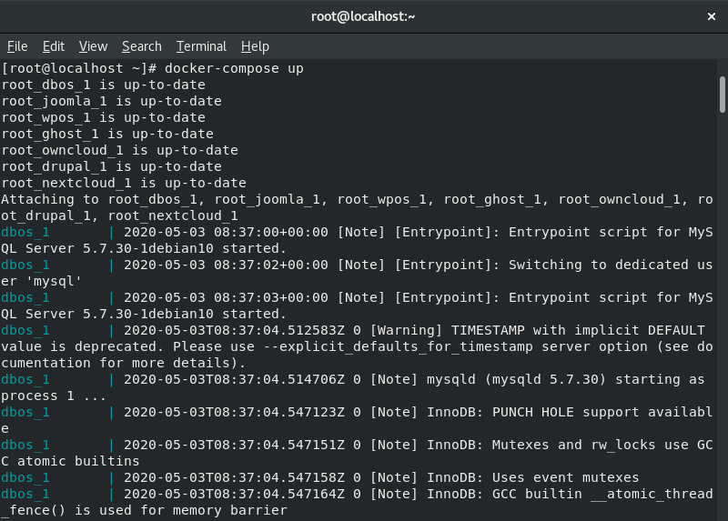
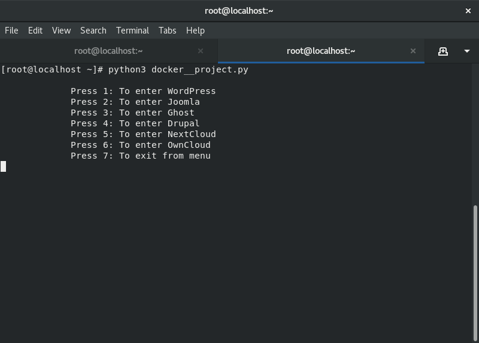
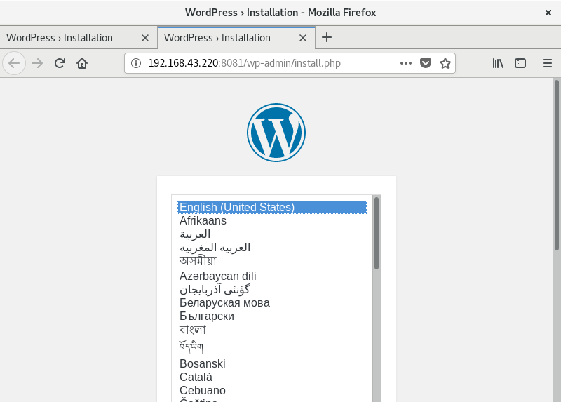

# Docker-compose-Project

This project is made to directly go on following sites in one click, this project is designed on docker and it is using python language to make it more interactive .
this project is for those who already know docker and it only run on the redhat operating system
It automatically connect with your IP all u have to do is just enter your IP in place of 192.168.43.220

# Requirements to Run the project 
1. Redhat linux OS
2. Python3 in redhat linux OS
3. Docker in redhat linux OS
4. Docker-compose  

# How to run the project

1. Download all the given files

2. Run 
```
docker-compose up  
```
3. Open new tab 

4. Then run 
```
python3 docker__project 
```
5. Now you have a menu choose according to your requirement

# Look and Feel






